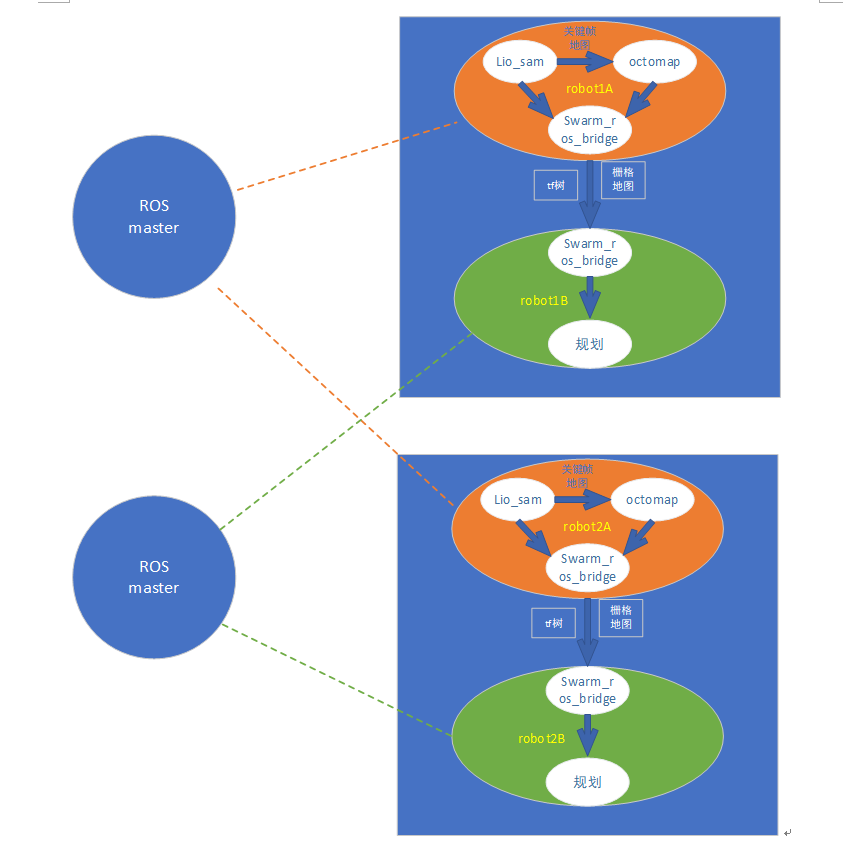

# swarm_ros_bridge

## Introduction

一个轻量级中间接口ROS包，主要基于[ZeroMQ](https://zeromq.org)。通过socket通信实现群机器人之间指定ROS消息的传输。此包的目的是取代传统的[在ROS1中跨多台机器运行ROS](https://wiki.ros.org/ROS/Tutorials/MultipleMachines)的方式，这种方式在群机器人情况下存在一些缺点。
例如： 发送栅格地图与tf树:



Compared with ROS1 multi-robot wireless communication, it has the following benefits:

-  **Robust**: No need for base station ROS master launching first. Support each robot launching in a random sequence and connecting each other autonomously.

-  **Flexible**:  You can choose the sending/receiving ROS topics rather than transferring all topic (names) as ROS1 does.

-  **Easy to use**:  Specify all the IP and ROS topics in one configuration file.

Compared with ROS2 DDS communication, it may have the following benefits:

-  **Lightweight**: It is a small ROS bridge node subscribing and sending remote ROS topics, so connecting with other ROS nodes is easy.
-  **Reliable**: It uses ZeroMQ socket communication based on TCP protocol while ROS2 is based on DDS, whose default protocol is UDP (unreliable). DDS is mainly designed for data exchange between native processes under wired communication rather than remote wireless communication.

核心工作：
利用ROS1自带的serialization对ROS话题消息进行序列化和反序列化，然后利用zeroMQ的PUB/SUB模式将消息发送，并为每个ROS接收话题建立一个接收线程。

ROS wiki page: https://wiki.ros.org/swarm_ros_bridge

source code: https://github.com/shupx/swarm_ros_bridge.git

csdn blog (in chinese): https://blog.csdn.net/benchuspx/article/details/128576723


## Structure

```bash
└── swarm_ros_bridge
    ├── CMakeLists.txt
    ├── config
    │   └── ros_topics.yaml  # Config file to specify send/receive ROS topics
    ├── include
    │   ├── bridge_node.hpp  # Header file of bridge_node.cpp
    │   ├── ros_sub_pub.hpp  # Header file for different ROS message type.
    ├── launch
    │   └── test.launch
    ├── package.xml
    └── src
        └── bridge_node.cpp  # @brief Reliable TCP bridge for ros data transfer in unstable network.
                             # It will send/receive the specified ROS topics in ../config/ros_topics.yaml
                             # It uses zmq socket(PUB/SUB mode), which reconnects others autonomously and
                             # supports 1-N pub-sub connection even with TCP protocol.
```


## Install

**Supported platforms/releases**:

| Platform                                                   | ROS Release                                                    |
| ---------------------------------------------------------- | -------------------------------------------------------------- |
| [Ubuntu 16.04 Xenial](https://releases.ubuntu.com/16.04.4/) | [ROS Kinetic](https://wiki.ros.org/kinetic/Installation/Ubuntu) |
| [Ubuntu 18.04 Bionic](https://releases.ubuntu.com/18.04/) | [ROS Melodic](https://wiki.ros.org/melodic/Installation/Ubuntu) |
| [Ubuntu 20.04 Focal](https://releases.ubuntu.com/20.04/) | [ROS Noetic](https://wiki.ros.org/noetic/Installation/Ubuntu) |

**Install process**:

```bash
## clone this package
mkdir -p swarm_ros_bridge_ws/src  # or your own ros workspace
cd swarm_ros_bridge_ws/src
git clone https://github.com/Pf0001/bridge.git

## install dependencies
sudo apt install libzmqpp-dev


## build
cd ../
catkin_make
source devel/setup.bash
```


## Usage

1. 配置 IP and ROS topic information in `config/ros_topics.yaml`. 

- 对于发送主题，IP是self(例如  * *)，端口应该不同，因为它绑定到“tcp://* *:port”. 
- 对于 receiving topic, IP和端口应该是远程源IP和端口，因为它连接到 "tcp://srcIP:srcPort".
- 话题名称就是ros话题名

(The `max_freq` only guarantees the sending frequency is lower than that but not be that. If the send_topics frequency is larger than max_freq, the node will decrease it by 2x, 3x, ... until it satisfies the max_freq.

2. Launch the bridge_node:

```bash
roslaunch swarm_ros_bridge test.launch
```

3. Publish messages into send_topics and check that remote recv_topics are receiving these messages. The console will also print INFO the first time recv_topics receive messages.


## Advanced

### * More ROS message types

The default supported ROS message types are only `sensor_msgs/Imu` and `geometry_msgs/Twist`. If you need more types:

1. Modify the macros about MSG_TYPEx and MSG_CLASSx in `include/ros_sub_pub.hpp`, then it will generate template functions for different ros message types.  

```cpp
// In ros_sub_pub.hpp
// uncomment and modify the following lines:
//例如
#include <sensor_msgs/PointCloud2.h>
#define MSG_TYPE3 "sensor_msgs/PointCloud2"
#define MSG_CLASS3 sensor_msgs::PointCloud2
```

We support up to 10 types modification. If that is still not enough, then you should modify the `topic_subscriber()`, `topic_publisher()` and `deserialize_publish()` in `include/ros_sub_pub.hpp` according to their styles.

2. Add the dependent package in find_package() of `CMakeLists.txt`:

```sh
# in CMakeLists.txt
find_package(catkin REQUIRED COMPONENTS
  roscpp
  std_msgs
  geometry_msgs
  sensor_msgs
  xxx_msgs
)
```

3. Recompile:

```bash
cd swarm_ros_bridge_ws/
catkin_make
```

### * More send_topics

We support up to 50 send_topics. Modify the following lines in `include/ros_sub_pub.hpp` if you need more.

```cpp
// in ros_sub_pub.hpp
# define SUB_MAX 50 // max number of subscriber callbacks
//...
template <typename T>
void (*sub_callbacks[])(const T &)=
{
  sub_cb<T,0>, sub_cb<T,1>, ... //add more
};

```

Then recompile:

```bash
cd swarm_ros_bridge_ws/
catkin_make
```


